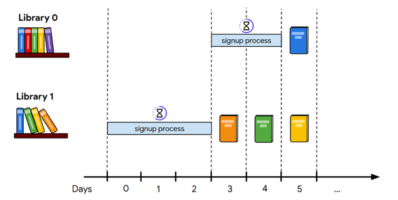
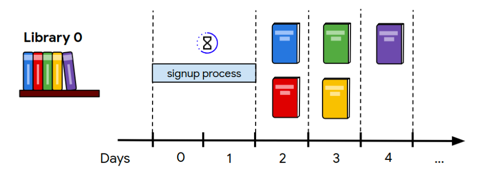

# Book Scanning

>Problem statement for the Online Qualification Round of Hash Code 2020

## Introduction

Books allow us to discover fantasy worlds and better understand the world we live in. They enable us to learn about everything from photography to compilers... and of course a good book is a great way to relax!

Google Books is a project that embraces the value books bring to our daily lives. It aspires to bring the world's books online and make them accessible to everyone. In the last 15 years, Google Books has collected digital copies of 40 million books in more than 400 [languages](https://www.blog.google/products/search/15-years-google-books/), partly by scanning books from libraries and publishers all around the world.

In this competition problem, we will explore the challenges of setting up a scanning process for millions of books stored in libraries around the world and having them scanned at a scanning facility.

## Task

Given a description of libraries and books available, plan which books to scan from which library to maximize the total score of all scanned books, taking into account that each library needs to be signed up before it can ship books.

## Problem description

### Books
There are **B** different books with IDs **from 0 to B–1**. Many libraries can have a copy of the same book, but we only need to scan each book once. Each book is described by one parameter: the score that is awarded when the book is scanned.

### Libraries
There are **L** different libraries with IDs **from 0 to L–1**. Each library is described by the following parameters:
* the set of books in the library,
* the time in days that it takes to sign the library up for scanning,
* the number of books that can be scanned each day from the library once the library is signed up.

### Time
There are **D** days **from day 0 to day D–1**. The first library signup can start on day 0. D–1 is the last day during which books can be shipped to the scanning facility.

### Library signup
Each library has to go through a **signup process** before books from that library can be shipped. Only one library at a time can be going through this process (because it involves lots of planning and on-site visits at the library by logistics experts): the signup process for a library can start only when no other signup processes are running. The libraries can be signed up **in any order**.

Books in a library can be scanned as soon as the signup process for that library completes (that is, on the first day immediately after the signup process, see the figure below). Books can be scanned in parallel from multiple libraries.

---------
For **example**, if
* The signup process for library 0 takes 2 days
* The signup process for library 1 takes 3 days
* The library 1 is signed up before library 0

then
* The signup process of library 1 starts on day 0, and finishes on day 2
* The first books from library 1 can be scanned starting on day 3
* The signup of library 0 starts on day 3, and finishes on day 4
* The first books from library 0 can be scanned starting on day 5

**Figure.** The signup process (blue bars) and the books being scanned from each library per day. Only one library can be in the signup process at a time, but books can be shipped in parallel by multiple libraries.
---------

### Scanning

All books are scanned in the scanning facility. The entire process of sending the books, scanning them, and returning them to the library happens in one day (note that each library has a maximum number of books that can be scanned from this library per day). The scanning facility is big and can scan any number of books per day.

---
For **example**, if library 0 has 5 books, can ship 2 books per day, and completes the signup processs on day 1, then:
* 2 books can be scanned on day 2
* 2 books can be scanned on day 3
* The remaining book can be scanned on day 4

---

## Input data set

### File format
Each input data set is provided in a plain text file. The file contains only ASCII characters with lines ending with a single '\n' character (also called “UNIX-style” line endings). When multiple numbers are given in one line, they are separated by a single space between each two numbers.

The first line of the data set contains
* an integer **B**(1<=B<=10^5) - the number of different books
* an integer **L**(1<=L<=10^5) - the number of libraries
* an integer **D**(1<=L<=10^5) - the number of days

This is followed by one line containing **B** integers **S0,...,SB-1 (0<=S<=10^3), describing the score of individual books, from book 0 to book B-1

This is followed by **L** sections describing individual libraries from library 0 to library L–1.
Each such section contains two lines:
* The first line contains:
** **Nj**(1<=Nj<=10^5) - the number of books in library **j**
** **Tj**(1<=Tj<=10^5) - the number of days it takes to finish the library signup process for library **j**
** **Mj**(1<=Mj<=10^5) - the number of books that can be shipped from library j to the scanning facility per day, once the library is signed up
* The second line, which contains Nj integers, describing the IDs of the books in the library. Each book ID is listed at most once per library

The total number of books in all libraries does not exceed 10^6

| Input  |  Description |
|---|---|
| 6 2 7  | There are 6 books, 2 libraries, and 7 days for scanning  | 
| 1 2 3 6 5 4  | The scores of te books are 1, 2, 3, 6, 5, 4  |
| 5 2 2  | Library 0 has 5 books, the signup process takes 2 days, and the library can ship 2 books per day  | 
| 0 1 2 3 4 | The books in library 0 are: book 0, book 1, ... |
| 4 3 1 | The library 1 has 4 books, the signup process takes 3 days, and the library can ship 1 book per day|
|3 2 5 0| The books in library 1 are: book 3, book 2, ...|

## Submissions
#File format
Your submission describes which books to ship from which library, and the order in which libraries are signed up.

The submission file must start with a line containing the integer **A** (0 ≤ **A** ≤ **L**) – the number of libraries to sign up (you don't need to sign up all libraries – the ones you skip are just ignored and no books are scanned from them).

Then, the submission file must describe each library, **in the order** that you want them to start the **signup process**. The description of each library must contain two lines:
* The first line containing
** **Y**(0<= **Y** <= **L–1**)– the ID of the library
** **K**(0<= **K** <= **Ny**)– the number of books to be scanned from library Y
  
* The second line containing the IDs of the books to scan from that library in the order that they are scanned, without duplicates

Each library must be described only once

Note that:
* You don't need to scan all books from a library you describe
* If a library signup process finishes after D days, its description will be ignored
* Books shiped after D days will be ignored

### Example
|Submission file|Description|
|---|---|
|2| Two libraries will be signed up for scanning|
|1 3| The first library to do the signup is library 1, after the signup process it will send 3 books for scanning|
|5 2 3| Library 1 will send book 5, 2, and 3 in order|
|0 5| The second library to do the signup process is library 0. After the signup process it will send 5 books|
|0 1 2 3 4| Library 0 will send book 0, 1, 3, 4 in that order|

## Scoring
Your score is the sum of the scores of all books that are scanned within **D** days. Note that if the same book is shipped from multiple libraries (as books 2 and 3 are in the figure below), the solution will be accepted, but the score for the book will be awarded only once.

